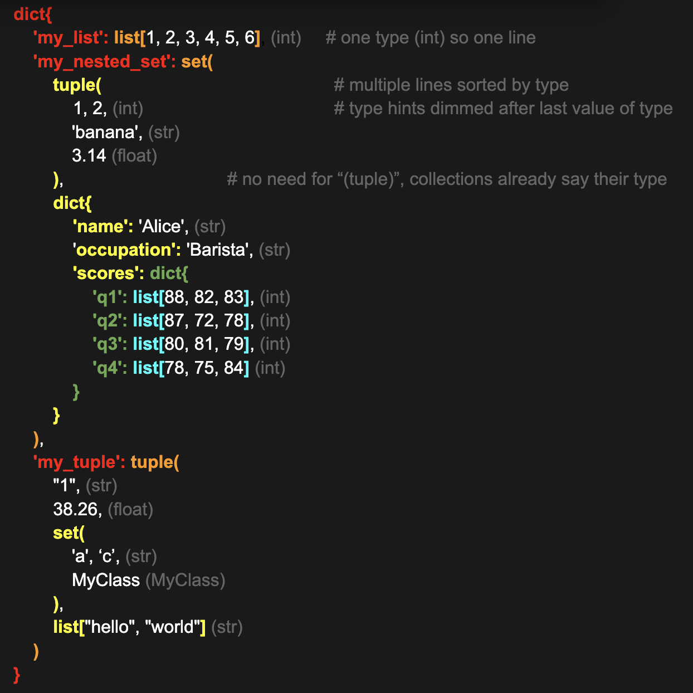

# FDL - Formatting, Debugging, and Logging for suitkaise

**NOTE: F-strings are not supported by fdl print. Use `<>` syntax instead!**  
**All commands are prefaced by a `/` as well.**

**PERFORMANCE ARCHITECTURE:**
- **Thread-safe design**: Custom progress bars, spinners, and tables avoid Rich's threading bottlenecks
- **Batched updates**: Progress bars use submitted updates with smooth animation
- **Cached terminal detection**: Terminal width/capabilities detected once at startup

## Setting up logging

```python
from suitkaise import fdl

# report from current file
rptr = fdl.log.from_current_file()

# or from another file (like a central module depending on this file)
central_rptr = fdl.log.from_file("parent_dir/central_module")

# report from a keyword instead of a file path
bus_rptr = fdl.log.from_this_key("Event_Bus")

# basic logging
rptr.info("Module initialized successfully.")

# using context manager to quickly use a different reporter
# if not a valid in project file path (and not a valid path at all) assumes entry is key
# you could just create another reporter, but...
# this removes the "lq" reporter from memory and looks and feels more intuitive
try:
    # some operation
    pass
except Exception as e:
    with fdl.log.Quickly("a/different/file/path") as lq:
        lq.error("<value1> was set to None so <value2> was not initialized. <e>", (value1, value2, e))

# log same message using multiple reporters
value1 = "database_connection"
value2 = "user_session"
msg = "<value1> was set to None so <value2> was not initialized."
values = (value1, value2)

rptr.warning(msg, values)
central_rptr.warning(msg, values)
bus_rptr.warning(msg, values)
```

## Setting up logging, cont: adjusting default settings

```python
from suitkaise import fdl

# change overall logging settings during program initialization
lsetup = fdl.log.get_setup()

# auto newline after every log statement (default=True)
lsetup.set_auto_newline(True)

# toggle sending to console (default=False)
lsetup.log.send_to_console(True)

# toggle sending to file (default=False)
lsetup.log.send_to_files(True)

# log to a certain file
lsetup.log_to_file("path/to/file")
# creates a new file every run
lsetup.create_log_file_in("path/to/dir")
# create a file in .sk.logs directory
lsetup.create_log_file() # no args

# enable/disable color (default=True)
lsetup.use_color(True)
# enable/disable unicode (unicode automatically falls back when outputting to file)
# auto detects unicode support and forces false if not supported
lsetup.use_unicode(True) # default=True

# wrap words that don't fit in remaining line space by putting them on the next line
# fdl.print functions automatically wrap! (see next section for fdl.print)
lsetup.use_wrapping(True) # default=True

# set default message format
time_config = {
    # using local time will also display timezone (timezone dimmed)
    'use_local_time': True, # default: UTC

    # if set to false, uses 12 hour cycle (13:20 = 1:20 pm)
    '24_hour_time': False, # default: True

    # dim hour numbers so that it is easier to read rest of timestamp
    'dim_hours': True, # default: False
    'dim_minutes' True, # default: False

    # use this many decimal places after seconds
    'decimal_places_after_seconds': 6
}
time_fmt = TimeFormat(time_config)
fmt = '<fdl.time> - <fdl.name> - <fdl.msgtype> - <fdl.message>'

# log format, fdl configs
lsetup.set_format(fmt, time_fmt)

# set what loggers you want to listen to
# listens to all loggers by default, but you can stop listening to certain ones
lsetup.stop_listening_to("paths_or_keys")

# see what we are ignoring
ignoring = lsetup.not_listening_to
# see what we are listening to
listening = lsetup.listening_to

# return original status
lsetup.listen_to("paths_or_keys_being_ignored")
# reset so that all are listened to
lsetup.listen_to()
```

## Setting up logging, cont: adjusting logger specific settings

```python
from suitkaise import fdl

# change individual logger settings, overrides default or SetupLogging behavior
rptr = fdl.log.from_current_file()

rptr.set_auto_newline(True)
rptr.log.send_to_console(True)

rptr.send_to_files(True)
rptr.create_log_file()
rptr.use_color(True)
# unicode is a program level option
rptr.use_wrapping(True)

# set default message format
config = {
    'use_local_time': False,
    '24_hour_time': True,
    'dim_hours': True,
    'dim_minutes' False,
    'decimal_places_after_seconds': 2
}
rptr_time_fmt = TimeFormat(config)
rptr_fmt = '<fdl.time> - <fdl.name> - <fdl.msgtype> - <fdl.message>'
rptr.set_format(rptr_fmt, rptr_time_fmt)
```

## Basic logging functions

```python
from suitkaise import fdl

rptr = fdl.log.from_current_file()

# standard logging
rptr.info("value1: <value1>, value2: <value2>", (value1, value2))
rptr.debug("Debug message", debug_value)
rptr.warning("Warning message", warning_data)
rptr.error("Error occurred", error_info)
rptr.critical("Critical issue", critical_data)

# success or fail
rptr.success("Operation completed", result)
rptr.fail("Operation failed", error)

# quick state messages
rptr.setToNone("Variable <var_name> set to None", var_name)
rptr.setToTrue("Flag <flag_name> enabled", flag_name)
rptr.setToFalse("Flag <flag_name> disabled", flag_name)

# save and load
rptr.savedObject("Object saved", object_info)
rptr.savedFile("File saved to <path>", file_path)
rptr.loadedObject("Object loaded", object_info)
rptr.loadedFile("File loaded from <path>", file_path)
rptr.importedObject("Imported <obj_name>", obj_name)
rptr.importedModule("Imported module <module>", module_name)

# general status (will add more)
rptr.scanning("Scanning <directory>", directory)
rptr.scanned("Scanned <count> files", file_count)
rptr.queued("Task queued", task_info)
rptr.leftQueue("Task dequeued", task_info)
rptr.leftQueueEarly("Task removed early", task_info)

# custom message type
rptr.custom(
    "value1: <value1>, value2: <value2>", 
    (value1, value2),
    "custom message type"
)
```

## Adding color and text formatting to messages

```python
from suitkaise import fdl

# getting available default colors, which are:
# red, orange, yellow, green, blue, purple
# magenta, cyan, pink, brown, tan,
# black, dark gray, gray, light gray, white
fdl.get_default_color_names()

# getting default text formatting
# bold, italics, underline, strikethough
fdl.get_default_text_formatting()

# adding color and text formatting to messages

# adding text formatting
fdl.print("</bold>This is bold text</end bold>")

# adding text color
fdl.print("</red>This is red text</end red>")
fdl.print("</ #FFFFFF>This is white text</end #FFFFFF>")
fdl.print("</rgb(0, 0, 0)>This is black text</end rgb(0, 0, 0)>")

# adding background color
fdl.print("</red, bkg blue>This is red text on a blue background</end red, bkg blue>")

# putting all 3 together
fdl.print(
    "</italic, green, bkg rgb(165, 165, 165)>"
    "This is italicized green text on a light gray background"
    "</end italic, green, bkg rgb(165, 165, 165)>"
    )

# resetting completely using </end all> and </reset>
fdl.print(
    "</italic, green, bkg rgb(165, 165, 165)>"
    "This is italicized green text on a light gray background"
    "</end all>" # or /reset
    )

# can add multiple text formats at once
fdl.print("</bold, underline>This is bolded and underlined text</end bold, underline>")

# order doesn't matter, unlike rich
# but commands must be separated by commas
fdl.print(
    "</italic, bkg green, black, bold>"
    "This is bolded, italicized, black text on a green background."
    "</reset>"
    )

# can remove some but not all
fdl.print(
    # add your color and text formatting
    "</italic, bkg green, black, bold>"

    "This is bolded, italicized, black text on a green background.\n"

    # end some of it
    "</end black, italic>"

    "This is now bold default color text, still on a green background.\n"

    # you don't have to explicitly end colors, you can just change them
    "</blue, strikethrough, bkg yellow>"

    # but you have to explicitly end text formatting, as they wont override each other!   
    "</end bold>"

    "This is now blue strikethough text on a yellow background"

    # if you aren't going to change the color/text anymore, you don't have to explicitly end things
    )

# loggers support the same formatting options!
rptr.error(
    "</bold, orange>"
    "<value1> was set to None so <value2> was not initialized.",
    # remember, no need to /end if the whole sentence uses the formatting!
    (value1, value2)
)
```

## Explicit time and date printing

### We have 7 time and date display commands: time, date, datelong, elapsed, time_ago, time_until, and day.

```python
from suitkaise import fdl
import time

from_64_sec_ago = time.time() - 64

# print current time in default timestamp format (hh:mm:ss.123456)
fdl.print("<time:>")

# print a given timestamp in default timestamp format
fdl.print("<time:from_64_sec_ago>", from_64_sec_ago)

# print current time in default date form (dd/mm/yy hh:mm:ss)
fdl.print("<date:>")
# print a given timestamp in date form
fdl.print("<date:from_64_sec_ago>", from_64_sec_ago)

# print a given timestamp in a different format
# July 4, 2025
fdl.print("<datelong:>")

# print the day of the week
# resutls in day of the week
fdl.print("<day:>")
fdl.print("<day:from_64_sec_ago>", from_64_sec_ago)

# using a command
# 16:30 -> 4:30 PM (accounts for daylight savings if timezone has daylight savings adjustments)
fdl.print("</12hr><time:>")

# timezones account for daylight savings
fdl.print("</tz pst><time:from_64_sec_ago>", from_64_sec_ago)

# using 24-hour format explicitly
fdl.print("</24hr><time:>")

# using smart time formatting for elapsed times
fdl.print("</smart time 3><elapsed:execution_started_at>", execution_started_at)

self.login_time = time.time() - 8274.743462
# "Login was (some time) ago"
fdl.print("Login was <time_ago:self.login_time>", self.login_time)

next_meeting = time.time() + 8274.743462
# "(some time) until"
fdl.print("<time_until:self.login_time> next meeting", next_meeting)

# "Time to complete: (some time)"
# elapsed finds absolute value of difference between given time float and current time
execution_started_at = time.time() - 68
fdl.print("Time to complete: <elapsed:execution_started_at>", execution_started_at)

# use commands to modify elapsed display
fdl.print("Logged in </smart time 2><time_ago:self.login_time>", self.login_time)

# printing time and values. VALUE ORDER MATTERS!
import os
pid = os.getpid()
value1 = True
fdl.print(
    "Process <pid> (<time:from_64_sec_ago>): value1 set to <value1>.",
    (pid, from_64_sec_ago, value1)
)
# or... without an explicit time value (<time:> uses current time!)
fdl.print(
    "Process <pid> (<time:>): value1 set to <value1>.",
    (pid, value1)
)

# variable name doesn't matter inside string, but please add the names to avoid errors!
# could technically do... won't cause issues if attribute names change
fdl.print(
    "Process <process> (<time:a_time>): value1 set to <1>.",
    (pid, from_64_sec_ago, value1)
)
```

### Key Object Types:

#### Time Objects:
- `<time:>` - Current time in hh:mm:ss.microseconds format
- `<time:timestamp>` - Specific timestamp in same format
- `<date:>` - Current time in date format
- `<date:timestamp>` - Date and time in dd/mm/yy hh:mm:ss format
- `<datelong:>` - Current time in datelong format
- `<datelong:timestamp>` - Long date format like "January 01, 2022"

#### Elapsed Objects:
- `<elapsed:timestamp>` - Elapsed time between timestamp and current time
- `<time_ago:timestamp>` - Elapsed time between timestamp and current time + "ago"
    fails if timestamp is greater than current time
- `<time_until:timestamp>` - Elapsed time between timestamp and current time + "until"
    fails if timestamp is less than current time
- Format: Shows only non-zero units in "3d 2h 15m 30.123456s" style
- Automatically chooses appropriate units (days, hours, minutes, seconds)

#### Time Commands:
- `</12hr>` - Use 12-hour format with AM/PM (removes leading zeros: "2:03:46.1234 AM" not "02:03:46.1234 AM")
- `</24hr>` - Use 24-hour format explicitly (opposite of </12hr>): "02:03:46.1234"
- `</tz timezone>` - Convert to specified timezone (supports daylight savings)
  - Examples: `</tz pst>`, `</tz est>`, `</tz utc>`, `</tz cet>`
- `</seconds>` - Display seconds and decimal places in timestamps (False by default)
  - When disabled: "2:03 AM" or "02:03" (clean HH:MM format)
  - When enabled: "2:03:46.1234 AM" or "02:03:46.1234" (full precision)
- `</decimals N>` - Control decimal places for timestamp seconds (0-10)
  - Only applies when `</seconds>` is enabled
  - Can be set even when seconds are disabled (takes effect when re-enabled)
  - Default is 4: "2:03:46.1234 AM" or "02:03:46.1234"  
  - `</decimals 0>` - No decimals: "2:03:46 AM" or "02:03:46"
  - `</decimals 2>` - Two decimal places: "2:03:46.12 AM" or "02:03:46.12"
  - `</decimals 6>` - Six decimal places: "2:03:46.123456 AM" or "02:03:46.123456"
- `</smart time N>` - Intelligent elapsed time formatting with N units
  - Shows the N most relevant time units automatically
  - Default is 3 units: `</smart time 3>`
  - Debug mode uses 10 units for maximum detail
  - Examples:
    - `</smart time 1>` - Shows only largest unit: "2d" or "13h" or "45m" or "30s"
    - `</smart time 2>` - Shows 2 units: "2h 15m" or "45m 30s"
    - `</smart time 3>` - Shows 3 units: "2h 15m 30s" (default)
    - `</smart time 5>` - Shows up to 5 units: "1d 2h 15m 30.0s"

  - Works like this: days = 1, hours = 1, minutes = 1, seconds = 1, and every decimal place = 1.
  - So if we have 12 smart units, it could look like this: 12d 11h 10m 9.87654321s

#### Timestamp Philosophy:
**FDL and Suitkaise in general use pure float-based Unix timestamps for everything.** No datetime objects, ISO formats, or complex time libraries. All timestamps are Unix floats (seconds since epoch), and formatting is done manually for finer control and cleaner output. This gives precise decimal control, simpler timezone logic, and consistent behavior across all time operations.

#### End Commands:
- `</end 12hr>` - Reset to 24-hour format (sets twelve_hour_time = False)
- `</end 24hr>` - Reset to 12-hour format (sets twelve_hour_time = True)  
- `</end tz>` - Reset timezone to None (removes timezone conversion)
- `</end seconds>` - Disable seconds display (sets use_seconds_in_timestamp = False)
- `</end smart time>` - Reset smart time to default (3 units)
- `</end decimals>` - Reset decimal places to default (4 places)

#### Usage Examples:
```python
# Clean time format (default - no seconds)
login_time = # a login time
fdl.print("User logged in at </12hr, tz est><time:login_time>", login_time)
# Result: "User logged in at 3:30 PM"

# Full precision time format
fdl.print("Server started at </24hr, tz utc, seconds><time:start_time>", start_time)
# Result: "Server started at 03:30:45.1234"

# Custom decimal precision
fdl.print("Event timestamp: </seconds, decimals 2><time:event_time>", event_time)
# Result: "Event timestamp: 02:25:33.12"

# Disable seconds for clean display
fdl.print("</end seconds>Meeting at <time:meeting_time>", meeting_time)
# Result: "Meeting at 2:30 PM"

# Relative time formatting with smart time
fdl.print("User logged in </smart time 2><time_ago:login_time>", login_time)
# Result: "User logged in 2h 15m ago"

# Detailed elapsed time
fdl.print("Process running for </smart time 4><elapsed:process_start>", process_start)
# Result: "Process running for 1d 5h 23m 45s"

# Simple elapsed time
fdl.print("Last seen </smart time 1><time_ago:last_activity>", last_activity)
# Result: "Last seen 3h ago"
```

## Creating Format objects

```python
from suitkaise import fdl

# create a format (uses fast FDL Format system - 52x faster than Rich Style!)
greentext_bluebkg = fdl.Format(
    name="greentext_bluebkg", 
    format="</green, bkg blue>"
)
# use a format
fdl.print(
    "</fmt greentext_bluebkg>"
    "This is green text with a blue background"
)

# create a format from a Format 
# (cannot override previously set formatting (text color, bkg color))
format2 = fdl.Format(
    name="format2",
    format="</fmt greentext_bluebkg, bold, italic>"
)
fdl.print(
    "</fmt format2, underline>"
    "This is green, bolded, italicized, underlined text on a blue background."
    "</end format2>"
    "This is now just underlined text."
)
```

## Error handling with fdl

**fdl uses a hybrid error handling approach:**
- **fdl internal errors**: Use standard Python traceback (for debugging fdl itself)
- **User/library errors**: Use beautiful custom error display

**Custom error features:**
- Clean file paths (relative to project root) using SKPath internal objects
- Code context with surrounding lines  
- Each stack frame in a separate box
- Simple but effective ANSI coloring
- Optional debug mode with local variables
- Thread-safe with no performance bottlenecks
- option to add/remove locals (locals are name, type, and support simple values only. if a local is not a simple value type, or if it is a collection, shows only name and type)

```
TRACEBACK (red and bold)
═════════════════════════════════════════════════════════════════════

╭──────────────────────────── Frame 1 ──────────────────────────────╮
│ src/myproject/main.py, line 45                                    │
│                                                                   │
│   42 │ def level_1():                                             │
│   43 │     session_id = "abc123"                                  │
│   44 │     timestamp = 1641234567                                 │
│ ❱ 45 │     return level_2()                                       │
│   46 │                                                            │
│                                                                   │
│ Local variables:                                                  │
│   session_id (str) = 'abc123'                                     │
│   timestamp (int) = 1641234567                                    │
╰───────────────────────────────────────────────────────────────────╯

╭──────────────────────── Frame 2 (current) ────────────────────────╮
│ src/myproject/utils.py, line 12                                   │
│                                                                   │
│   10 │     data = [1, 2, 3]                                       │
│   11 │     config = {"debug": True}                               │
│ ❱ 12 │     return data[10]  # IndexError                          │
│   13 │                                                            │
│                                                                   │
│ Local variables:                                                  │
│   username (str) = 'alice'                                        │
│   data (list) = [...]                                             │
│   config (dict) = {...}                                           │
╰───────────────────────────────────────────────────────────────────╯

╭─────────────────────────── Exception ─────────────────────────────╮
│ IndexError: list index out of range                               │
╰───────────────────────────────────────────────────────────────────╯
```

## Using debug mode

### - Debug mode adds a type annotation right after the value, so you know what the value is. It also prints strings as is, without any formatting.


```python
from suitkaise import fdl
value1 = 32

# use direct function
fdl.dprint("value1 was set to <value1>.", value1)

# use formatting
fdl.print("</debug>value1 was set to <value1>.", value1)

# get type annotation individually
fdl.print("value1 was set to <type:value1>.", value1)
```
Looks like: 

original: `"value1 was set to <value1>."`

In debug mode, all `<values>`, when substituted, are bolded, italicized, and color coded according to their type. They also have a dimmed type hint in parentheses after the value.

int: value1 was set to ***(cyan)32*** (int).

True: value1 was set to ***(green)True*** (bool).

False: value1 was set to ***(red)False*** (bool).

None: value1 was set to ***(blue)None*** (None).

float: value1 was set to ***(cyan)3.14159*** (float).

debug mode handles strings differently. usually, if you insert a string as a variable into an fdl string, the result will be formatted if there are commands or ansi codes. however, debug mode prints as is.

string: value1 was set to ***(green)"***</bold>Hello, World!***(green)"*** (str).

## Printing code blocks and markdown files

```python
from suitkaise import fdl # line 1

def fibonacci(n): # line 3
    """Calculate fibonacci number"""
    if n <= 1:
        return n
    return fibonacci(n-1) + fibonacci(n-2) # line 7

# print code from line 3-7 in paraiso dark theme
fdl.codeprint(3, 7, "paraiso-dark")

# available syntax themes from rich:
# material, monokai, native, fruity, vim, rrt,
# paraiso-dark, solarized-dark, github-dark,
# nord, nord-darker, gruvbox-dark

# printing markdown text in a python file
fdl.mdprint(start_line, end_line)

# printing a .md file (will print as code if not a MarkDown file)
fdl.mdfileprint("path/to/file.md")
```

## Printing out complex, nested value structures

When we have a nested structure of collections (dicts, lists, tuples, and sets), we format them in a way that makes them easier to read.

Complex structures get printed to the 6th level of nesting. Based on how many levels a collection is nested, we color its brackets/parentheses a different color.

Level 1 (outermost collection) is red, then orange, yellow, green, blue, and purple. The colors are designed to be colorblind friendly.

Brackets/parentheses are also bolded. Keys of dicts are bolded and colored the same color as their dict's brackets.

Additionally, we sort data in collections by type, and annotate the type after we have listed out all of that collection's values of said type.




```python
from suitkaise import fdl

my_nested_collection = { # level 1
    'my_list': [ # level 2
        1, 2, 3, 4, 5, 6
    ], # level 2
    'my_nested_set': set( # level 2
        ( # level 3
            1, 2, 'banana', 3.14
        ), # level 3
        { # level 3
            'name': 'Alice',
            'occupation': 'Barista',
            'scores': { # level 4
                'q1': [88, 82, 83],
                'q2': [87, 72, 78],
                'q3': [80, 81, 79],
                'q4': [78, 75, 84]
            } # level 4
        } # level 3
    ), # level 2
    'my_tuple': (
        # set and list are level 3
        "1", 38.26, set('a', MyClass, 'c'), ["hello", "world"]
    ) # level 2
} # level 1

fdl.print("<nested_collection>", my_nested_collection)
```

## Using decorators to set formats for functions

```python
from suitkaise import fdl

@fdl.autoformat("</bkg dark gray>")
def fibonacci(n):
    """Calculate fibonacci number"""
    if n <= 1:
        pass
    else: 
        n = fibonacci(n-1) + fibonacci(n-2)
    # auto applies format
    fdl.print("Result: <n>", n)
    # disable autoformat
    fdl.print("</end autofmt>Result: <n>", n)
    return n

# ❌ does not auto apply format to return value ❌
# (still applies format to print statements inside)
fdl.print("<result>", fibonacci(8))

# applies format to print statements inside function!
fibonacci(9)

# automatically set debug mode
@fdl.autodebug()
def fibonacci(n):
    """Calculate fibonacci number"""
    if n <= 1:
        pass
    else: 
        n = fibonacci(n-1) + fibonacci(n-2)
    # auto applies debug mode
    fdl.print("Result: <n>", n)
    # disable autodebug
    fdl.print("</end autodebug>Result: <n>", n)
    return n
```

## Creating progress bars

Progress bars can be created, and when they do, you cannot print anything new to the terminal until it completes, is removed, or stopped (except for progress bar messages)

```python
from suitkaise.fdl import ProgressBar

# can either create it with params or config, params override config
bar = ProgressBar(total=100, title=None, bar_color=None, text_color=None, bkg_color=None, ratio=True, percent=False, rate=False, config)
# total: total increments to completion
#  - must be an int of 2 or higher
#  - can only be incremented using ints, no decimal increments
# title: leading text before bar
#  - bar will be on separate line if title is too long.
# bar_color: color of progress bar
# text_color: color of statistic text and "--" before update messages, and default message and title color
#  - default text color can be overridden by formatting
# bkg_color: background color of bar and message lines
# ratio: whether to display N/total completed
# percent: whether to display percent completion
# rate: whether to display rate per second
# config: dict setup of params


# create with params
bar = ProgressBar(100, "  Loading data:", "green", "black", "gray", ratio=False, rate=True)

# create with config
config = {
    "bar_color": "cyan",
    "message_color": "cyan",
    "ratio": True,
    "percent": False,
    "rate": True,
}
bar = ProgressBar(self._num_to_load, "  Loading Data:", config=config)

# add fdl formatting to a title (text formatting and text color only)
bar = ProgressBar(self._num_to_load, "  </bold, italic, green>Loading Data:", config=config)

# display the bar 
bar.display()

# updating progress bar N number of increments
# Uses batched updates for smooth performance in threading
# message goes under the bar, and line with message gets replaced when another message comes in.
bar.update(7, "message")

# add formatting to messages
bar.update(7, "</bold, cyan>Batch</blue> <self.batch_count></end blue, bold> loaded successfully.", self.batch_count)

# if this bar reaches 100, text can be outputted again.

# blocking bar from updating further (stays in output, but does not complete.)
# allows text to be outputted again on a new line under the message line.
bar.stop()
```
## Creating spinners and boxes

**Spinners**
```python
from suitkaise import fdl

fdl.print("<spinner:arrows>a message") 
fdl.print("<spinner:dots>a message")
fdl.print("<spinner:letters>a message")

# or use a command:
fdl.print("</spinner arrows>a message")

# adding color and background to a spinner is exactly the same as text!
# does not support text formatting like bold, italic, etc.

# you can only have one active spinner at a time. if a new spinner is created, the last one stops.

# stopping a spinner manually
fdl.stop_spinner()
```

**Boxes**
```python
from suitkaise import fdl

# supported: square, rounded, double, heavy, heavy_head, horizontals 
# (fallback: ascii)

# print a whole message in one box
fdl.print("</box rounded>a message")

# or some in a box and some out
fdl.print(
    "</box double>"
    "a message in a box"
    "</end box>"
    "\na message outside the box"
)

# adding a title to the box
fdl.print("</box rounded, title Important>a message")

# adding a color to the box (if no color, takes current text color)
fdl.print("</box rounded, title Important, green>a message")

# justifying box (boxes are left by default, but box text is centered by default!)
fdl.print("</box rounded, title Important, green, justify right>a message")
```

## Justifying text

```python
from suitkaise import fdl

fdl.print("</justify left>a message justified left")
fdl.print("</justify right>a message justified right")
fdl.print("</justify center>a message justified centered")

# default is left. changing justification or ending justification creates a new line unless justify is already left. default inside boxes is center
```

## Creating tables

# Complete Table Concept v6 - Enhanced Implementation

## Core Design Principles

- **API-driven data management** - No direct data manipulation
- **Headers-first approach** - Must define structure before adding data
- **Clean content matching** with tuple formatting
- **Background color text-only** - No cell/border backgrounds
- **Smart display methods** with clear naming
- **Standalone feature** - Not integrated with fdl.print(), uses own display methods
- **Enhanced duplicate handling** - Powerful search, update, and formatting for duplicate data
- **Data integrity protection** - Prevents duplicate headers and enforces constraints

## Table Creation & Header Setup

```python
from suitkaise import fdl

# Create table with style and optional constraints
table = fdl.Table(style="rounded")  # rounded, square, double, simple
table = fdl.Table(style="rounded", max_columns=5, max_rows=10)

# MUST set up headers first (defines table structure)
table.add_header("Component")
table.add_headers(["Status", "Usage", "Temperature"])

# Or all at once
server_table = fdl.Table(style="rounded")
server_table.add_headers(["Server", "Status", "CPU", "Memory", "Uptime"])
```

## Enhanced Header Management

```python
# Add new header (adds empty column to all existing rows)
table.add_header("Location")  # All existing rows get empty "" in this column

# Remove header (removes entire column and all its data)
table.remove_header("Temperature")  # Deletes column and all temperature data

# Get current headers
headers = table.get_headers()  # Returns copy of headers list

# Duplicate header validation (prevents data integrity issues)
table.add_headers(["Name", "Age", "City"])
table.add_header("Name")  # ❌ Raises: "Header 'Name' already exists"

# Internal duplicate validation
table.add_headers(["Country", "Age", "Phone"])  # ❌ Raises: "Header 'Age' already exists in the table"

# Duplicate within list validation
table.add_headers(["Country", "Country", "Phone"])  # ❌ Raises: "Duplicate header 'Country' in the provided list"

# Max columns constraint
table = fdl.Table(max_columns=3)
table.add_headers(["A", "B"])
table.add_headers(["C", "D"])  # ❌ Raises: "Cannot add headers: max_columns (3) would be exceeded"
```

## API-Based Data Population

```python
# Add single row
table.add_row_data(["CPU", ("Critical", "</red, bold>"), "85%", "72°C"])

# Add multiple rows
table.add_row_data([
    ["GPU", "Normal", ("12%", "</green>"), "65°C"],
    ["RAM", ("Warning", "</yellow>"), "67%", "45°C"],
    ["SSD", ("Failed", "</red, blink>"), "0%", "N/A"]
])

# Remove rows by content matching (matches plain strings only)
table.remove_row_data(["CPU", "Critical", "85%", "72°C"])  # Matches plain text only

# Or remove multiple rows
table.remove_row_data([
    ["GPU", "Normal", "12%", "65°C"],
    ["RAM", "Warning", "67%", "45°C"]
])
```

## Enhanced Cell Updates & Content Matching

```python
# Update by header + row position (1-based indexing)
table.set_cell(header="Status", row=3, value=("Critical", "</red, bold>"))

# Enhanced update by finding current content with optional filters
table.update_cell(
    current_cell_content="GPU",  # Finds "GPU" in any cell
    new_cell_content=("Graphics Card", "</italic>")
)

# Update with header filter only
table.update_cell("Laptop", "Premium Laptop", headers="Product")

# Update with row filter only  
table.update_cell("In Stock", "Available", rows=range(1, 4))

# Update with both filters
table.update_cell("Mouse", "Wireless Mouse", headers="Product", rows=[2, 7])

# Update all cells with matching content
updated_count = table.update_all_cells_with("$25", "$30")  # Returns number of cells updated

# Content matching works on tuple text only
# ("GPU", "</bold>") matches search for "GPU"
# "</red>GPU</reset>" in plain string triggers format warning
```

## Enhanced Search Operations

```python
# Find rows in specific column
critical_rows = table.find_rows(header="Status", content="Critical")
# Returns list of row numbers where Status content = "Critical"

# Enhanced search across all columns
laptop_occurrences = table.find_all_occurrences("Laptop")
# Returns: {'Product': [1, 3, 5]} - dict with headers as keys and row numbers as values

# Find all occurrences of specific content
status_occurrences = table.find_all_occurrences("In Stock")
# Returns: {'Status': [1, 2, 5, 7]}

# Find price occurrences
price_occurrences = table.find_all_occurrences("$25")
# Returns: {'Price': [2]}
```

## Enhanced Formatting Operations

```python
# Format all cells with matching content
formatted_count = table.format_all_cells_with("Electronics", "</bold>")
formatted_count = table.format_all_cells_with("Available", "</green>")
formatted_count = table.format_all_cells_with("Premium Laptop", "</red, bold>")

# Traditional formatting methods
table.format_column("Status", "</green, bold>")
table.format_row(3, "</italic>")
table.format_cell(header="Temperature", row=2, format="</yellow>")
table.format_headers("</underline, bold>")

# Format matching cells in specific column
table.format_matching_cells(
    header="Status", 
    content="Critical", 
    format="</red, bold, blink>"
)

# Reset methods
table.reset_formatting()                           # Everything
table.reset_column_formatting("Status")            # Specific column
table.reset_row_formatting(5)                      # Specific row
table.reset_cell_formatting(header="Usage", row=3) # Specific cell
table.reset_header_formatting()                    # Just headers
```

## Tuple-Based Formatting

```python
# Clean separation of data and formatting
table.data = [
    ["Component", "Status", "Usage"],
    ["CPU", ("Critical", "</red, bold>"), "85%"],      # Formatted cell
    ["GPU", "Normal", ("12%", "</green>")],            # Formatted cell
    ["RAM", "Warning", "67%"]                          # Plain cell
]

# Or apply formatting after data creation
table.format_cell(header="Status", row=1, format="</red, bold>")
```

## Background Color Restriction

```python
# ✅ CORRECT - Background colors apply only to text content
table.add_row_data([
    ["CPU", ("Critical", "</red, bkg yellow>"), "85%"]  # Yellow background on "Critical" text only
])

table.format_column("Status", "</green, bkg blue>")  # Blue background on text in Status column

# The table cell whitespace and borders remain unchanged
# Only the actual text content gets the background color
```

## Display Methods

```python
# Default: shows rows 1-10
table.display()

# Custom range
table.display(start_row=1, end_row=20)    # Rows 1-20
table.display(start_row=25, end_row=35)   # Rows 25-35

# Show all rows (clear method name)
table.display_all_rows()  # Instead of end_row=None

# Alternative display method
table.print()  # Same as display()
table.print_all_rows()  # Same as display_all_rows()

# Get output in different formats
output = table.get_output(start_row=1, end_row=10)
terminal_output = output['terminal']  # ANSI formatted
plain_output = output['plain']        # Clean text
markdown_output = output['markdown']  # Markdown format
html_output = output['html']          # HTML table
```

## Format Validation & Warnings

```python
# ⚠️ INVALID - FDL commands in content
table.add_row_data([
    ["CPU", "</red>Critical</reset>", "85%"]  # ❌ Wrong!
])

# When table.display() is called (once per display session):
# Warning: FDL commands detected in cell content "</red>Critical</reset>". 
# Use tuple format: ("Critical", "</red>") instead.

# ✅ CORRECT - Tuple format
table.add_row_data([
    ["CPU", ("Critical", "</red>"), "85%"]  # ✅ Right!
])
```

## Formatting Priority System

```python
# Priority order (highest to lowest):
# 1. Tuple formatting
table.data[1][1] = ("Critical", "</red, bold>")

# 2. Cell formatting  
table.format_cell(header="Status", row=1, format="</green>")

# 3. Column formatting
table.format_column("Status", "</blue>")

# 4. Row formatting (lowest)
table.format_row(1, "</italic>")

# Result: "Critical" displays as red/bold (tuple wins)
```

## Properties

```python
# Property methods (not function calls)
total_rows = table.row_count        # Number of data rows
total_cols = table.column_count     # Number of columns
headers = table.header_count        # Alias for column_count
```

## Advanced API Methods

```python
# Table information
headers = table.get_headers()         # Returns ["Server", "Status", ...]

# Cell access
table.get_cell(header="Status", row=2)  # Get specific cell
table.get_row(3)                        # Get entire row
table.get_column("Status")              # Get entire column

# Clear operations
table.clear_all_data()        # Removes all rows, keeps headers
table.clear_formatting()      # Removes all formatting, keeps data
table.clear_headers()         # Removes headers and all data (reset table)

# Copy operations
copied_table = table.copy()   # Creates independent copy

# Memory management
table.release()               # Releases table from memory (new requirement)
```

## Table Generation System

### Cell Dimension Rules
- **30 character limit** per cell (left edge to right edge)
- **1 space padding** on each side (26 usable characters)
- **Text wrapping** at 26 characters using text wrapper
- **Visual width calculation** using wcwidth for Unicode/emojis
- **Row height** determined by tallest cell in that row
- **Column width** determined by widest cell in that column

### Pseudo Matrix System
Each cell contains:
- Cell dimensions (width, height)
- Original plain string content
- Original formatting string (from tuple)
- Format state for the cell (combined from tuple + column + row + cell formatting)
- Formatted and wrapped string output
- Visual width calculations

### Format State Integration
- **Column format states** - Store column-wide formatting
- **Row format states** - Store row-wide formatting  
- **Cell format states** - Combined formatting from all sources
- **Priority system** - Tuple > Cell > Column > Row

### Multi-Format Output
All display methods generate 4 output streams:
- **Terminal**: ANSI formatted table with proper box borders
- **Plain**: Clean text table without formatting
- **Markdown**: `| Header | Header |` table format
- **HTML**: `<table><tr><td>` with CSS classes

## Complete Working Example

```python
from suitkaise import fdl

# Create server monitoring table
server_table = fdl.Table(style="rounded", max_columns=6, max_rows=20)

# Define structure first
server_table.add_headers(["Server", "Status", "CPU", "Memory", "Uptime"])

# Add data rows with duplicate content
server_table.add_row_data([
    ["Web-01", "Running", "45%", "2.1GB", "15 days"],
    ["Web-02", ("Critical", "</red, bold>"), ("89%", "</yellow, bkg red>"), "3.8GB", "2 days"],
    ["DB-01", "Running", "78%", "15.2GB", "45 days"],
    ["DB-02", ("Maintenance", "</orange, italic>"), "5%", "1.2GB", "0 days"],
    ["Cache-01", ("Stopped", "</red>"), "0%", "512MB", "0 days"]
])

# Add more servers one by one
server_table.add_row_data(["Load-01", ("Online", "</green>"), ("12%", "</cyan>"), "8GB", "30 days"])

# Enhanced search operations
laptop_occurrences = server_table.find_all_occurrences("Running")
print(f"Running servers: {laptop_occurrences}")  # {'Status': [1, 3]}

# Enhanced update operations
updated_count = server_table.update_all_cells_with("Running", "Active")
print(f"Updated {updated_count} cells")

# Update with filters
server_table.update_cell("Web-02", "Web-Primary", headers="Server")
server_table.update_cell("Critical", "Recovered", rows=range(1, 3))

# Enhanced formatting operations
formatted_count = server_table.format_all_cells_with("Active", "</green>")
print(f"Formatted {formatted_count} cells")

# Apply traditional formatting
server_table.format_headers("</bold, underline>")
server_table.format_column("CPU", "</cyan>")
server_table.format_column("Memory", "</blue>")

# Display first 5 rows
server_table.display(start_row=1, end_row=5)

# Get output in different formats
output = server_table.get_output(start_row=1, end_row=3)
print("Terminal output length:", len(output['terminal']))
print("Markdown output length:", len(output['markdown']))

# Clean up memory when done
server_table.release()
```

## Enhanced Features Summary

### Duplicate Data Handling
- **`find_all_occurrences()`** - Search across all columns with structured results
- **`update_all_cells_with()`** - Update all cells with matching content
- **Enhanced `update_cell()`** - Flexible filtering with headers and rows
- **`format_all_cells_with()`** - Format all cells with matching content
- **Range support** - Use `range(1, 4)` for row filtering
- **Multiple selection** - Target multiple headers or rows simultaneously

### Data Integrity Protection
- **Duplicate header validation** - Prevents adding existing headers
- **Internal duplicate detection** - Prevents duplicates within `add_headers()` calls
- **Max constraints enforcement** - Respects `max_columns` and `max_rows` limits
- **Clear error messages** - Descriptive feedback for all validation failures

### Advanced Filtering
- **Header filters**: `str`, `List[str]`, `Tuple[str, ...]`, or `None`
- **Row filters**: `int`, `List[int]`, `range`, or `None`
- **Combined filters**: Use both headers and rows for precise targeting
- **Range operations**: `range(1, 4)` for row ranges

## Key Benefits

✅ **Error Prevention** - API prevents malformed data structures  
✅ **Headers-First Design** - Clear table structure before data  
✅ **Safe Content Matching** - Match on content, preserve formatting  
✅ **Flexible Views** - Copy and modify tables for different audiences  
✅ **Clear Display Options** - Explicit methods for different ranges  
✅ **Text-Only Backgrounds** - Proper background color handling  
✅ **Format Validation** - Helps users adopt correct tuple format  
✅ **Smart Cell Sizing** - Automatic width/height calculation with wrapping  
✅ **Visual Width Aware** - Proper Unicode and emoji support  
✅ **Multi-Format Output** - Terminal, plain, markdown, HTML support  
✅ **Memory Management** - Explicit resource cleanup with release()  
✅ **Standalone System** - Independent of fdl.print() for dedicated table display  
✅ **Enhanced Duplicate Handling** - Powerful search, update, and formatting for duplicate data  
✅ **Data Integrity Protection** - Prevents duplicate headers and enforces constraints  
✅ **Advanced Filtering** - Flexible header and row-based filtering for precise operations  

This API-driven approach eliminates user errors while providing maximum flexibility for table creation, management, and display with proper resource management, multi-format output support, and comprehensive duplicate data handling capabilities.

## Performance Architecture Summary

We have created a simpler, command-based system that allows all formatting to be done right in the string. It is clearer than Rich, and keeps it simpler so that overhead is less and users are not as overwhelmed. It gives options to adjust settings at the module level, the function level, and the individual string level. All formatting options are supported by our logging system as well! A logging system that improves on the standard logging and Rich logging with simpler, fine-tuned behavior.

We will start by creating private equivalents to all of these methods so that any printing or logging from suitkaise itself will match user defaults! Then, we will wrap the internal logic with public counterparts. ex. `format_ops._print` -> `fdl.print`.

## Implementation Plan

### Basic fdl printing 
1. Parser - DONE FOR NOW
2. Command processor and reconstructor
- converts simple commands (`</red>`, `</bold>`) directly to ANSI
- caches all simple command ANSI equivalents on launch

- converts simple combinations (`</red>, bold>`) directly to ANSI by combining cached simple command ANSI
- does not cache combinations, inefficient

- caches color conversions (`</ #FFFFFF>`, `</rgb(255, 0, 0)>`) on first encounter, storing reference to color code and ANSI equivalent

- supports IDE friendly hexing, where adding a `' ' ` after the `/` allows you to change color easily, and standard `</#FFFFFF>` without a space after `/`.

- caches `fdl.Formats` on first creation, and lookups later when user does `</fmt (an fdl.Format)>`

- for complex combinations like `</fmt base, rgb(255,0,0)>`, attempts lookups first for each entry and then combines ANSI. If a newly encountered color needs to be converted and cached for the first time, does that first and then combines.

3. fdl Format class DONE
4. Renderer - Combine everything into final output
- also handle output to other destinations (files, MarkDown and HTML)
5. Internal `_print()` functions that tie basic execution together

### Advanced objects
6. Time objects - `<time:>`, `<elapsed:duration>` handling DONE
7. Custom progress bar - using cached terminal width and batched updates with smooth animation
8. Custom spinners - global state, simple animation
9. Custom tables - pre-calculated layout, row/column limits
10. Error handler - custom, lightweight traceback system

### Logging system
11. Reporters - file and key based loggers
12. Message Types - Standard logging levels and other convenience messages (success, setToNone, etc.)
13. special Format classes - TimeFormat, NameFormat (WIP), TypeFormat (WIP), and message format (`fdl.Format`)

### Finishing Renderer
14. finish MarkDown and HTML output support

### API
15. Decorators - `@fdl.autoformat`, `@fdl.autodebug`
16. Public API - wrapping internal functions with public interface to match this conceptual code
17. Optimizations - reviewing and adjusting caching, speed, and resource usage

## Changes and Updates

All text now wraps smartly when encountering spaces, dashes, periods, commas, colons, semicolons, both slashes, question marks and exclamation points.

Removing user defaults. All formatting should be done inside strings using fdl format.

Box color does not inherit from text color automatically, must be set itself but you can do `</box ..., color current>` to get the same color.

Elapsed splits into 'time_elapsed', 'time_ago', and 'time_until', getting rid of respective commands.

Time commands are now set independently from time objects.

### New Processing Flow Example

Here is a full run-through of the flow.

```python
if self._is_online:
    fdl.print(
        '</cyan, bold>Time: </12hr, tz pst><time:></end cyan>'
        '</box rounded, color current, bkg gray, title <self.name>>'
        '</green, italic>Online</reset> since </cyan><time:self.time_connected_at>'
        '</end box></reset>'
        '</format warning>'
        '</justify center>'
        'Warning: This is an example warning outside of the status box.',
        (self.name, self.time_connected_at)
    )
```

Before starting, we will measure the initial terminal width. assuming a hard minimum width of 60.

First, we create a blank _FormatState object. This tracks everything that is needed in order to process and generate formatted output from fdl strings.

Next, we parse this message, now concatenated to:

`"</cyan, bold>Time: </12hr, tz pst><time:></end cyan></box rounded, color current, bkg gray, title <self.name>></green, italic>Online</reset> since </cyan><time:self.time_connected_at></end box></reset></format warning></justify center>Warning: This is an example warning outside of the status box."`

And split it like this:

1. `</cyan, bold>` (text command)
2. `'Time: '` (plain text string)
3. `</12hr, tz pst>` (time command)
4. `<time:>` (time object)
5. `</end cyan>` (text command)
6. `</box rounded, color current, title <self.name>>` (box command)
7. `</green, italic>` (text command)
8. `'Online'` (plain text string)
9. `</reset>` (misc command)
10. `' since '` (plain text string)
11. `</cyan>` (misc command)
12. `<time:self.time_connected_at>` (time object)
13. `</end box>` (box command)
14. `</reset>` (misc command)
15. `</format warning>` (format command)
16. `</justify center>` (layout command)
17. `'Warning: This is an example warning outside of the status box.'` (plain text string)

Next, we sequentially process each split piece, updating the format state.

1. `</cyan, bold>`
- Updates `text_color` to cyan and `bold` to True in _FormatState.

2. `"Time: "`
- Adds `(ansi code for cyan and bold text)Time: (reset code)` to raw outputs, according to _FormatState.

3. `</12hr, tz pst>`
- Sets `twelve_hour_time` to True and `timezone` to 'pst' in _FormatState.

4. `<time:>`
- Adds the current time to the raw outputs displayed as 12 hour time (vs standard 24 hour time), accounting for the Pacific time zone, and adding bold and cyan to the text. 
- `(ansi code for cyan and bold text)(current timestamp formatted)(reset code)`

5. `</end cyan>`
- Sets `text_color` to None in _FormatState.

6. `</box rounded, color current, title <self.name>>`
To output:
- we need to format and handle previous text before we start the box.
- adds a \n.
- combines list of strings into one string.
- Wraps and justifies all raw output so far using _TextWrapper and _TextJustifier, and adds to the regular outputs.

In _FormatState:
- sets `in_box` to True, 
- sets `box_style` to "rounded"
- sets `box_color` to the current text color.
- sets `box_title` to `self.name`, as long as the user provides self.name as a variable after the fdl string. removes the variable from the tuple.

7. `</green, italic>`
- Sets `text_color` to green and `italic` to True in _FormatState.

8. `"Online"`
- Adds 'Online' in green italics to `box_content` list. 
- `(ansi code for green and italic text)Online(reset code)`

9. `</reset>`
- In _FormatState, resets all variables that have a direct impact on output except box related ones.

10. `" since "`
- Adds ' since ' to box_text, with no formatting because we just reset it. 
- ` since (reset code)`

11. `</cyan>`
- Sets text color to cyan in _FormatState.

12. `<time:self.time_connected_at>`
- Adds the next value in the tuple as a formatted timestamp as long as it is a float. 
- If it isnt a float, we display `</ERROR>`
- Our format is still 12 hour time in the PST timezone from earlier.
- `(ansi code for cyan)(formatted given timestamp)(reset code)`
- Removes second value from tuple.


17. `'Warning: This is an example warning outside of the status box.'`

13. `</end box>`
- This is when the entire box gets generated and added to outputs.
- combine `box_content` list of strings. Wrap combined string across lines according to the _TextWrapper and center text using the _TextJustifier.
- measure maximum width of wrapped text (a list of strings). the `actual_box_width` will be 6 more than that, to account for 2 spaces of padding on both sides and the borders.
- generates and colors borders and title according to `box_style` and `box_title`, around our existing content, adding a newline at the end of the bottom right corner.
- strip whitespace on both sides of box. combine list of box lines into one string.
- reprocess box through text wrapper and justifier, justify box according to active text justification.
- completed box gets directly added to finished output.
- reset all box related variables to defaults.

14. `</reset>`
- In _FormatState, resets all variables that have a direct impact on output except box related ones.

15. `</format warning>`
- Gets warning format ('</bkg yellow, black, bold>') from the _FormatRegistry.
- parses and splits string just like main flow (in this case, we just have one command type).
- applies <> commands to _FormatState (adds yellow to `background_color`, black to `text_color`, and sets `bold` to True.)

16. `</justify center>`
- processes all text in raw outputs according to the current justification, processing it with the text wrapper and the text justifier.
- Sets `justify` to center in _FormatState.

17. `"Warning: This is an example warning outside of the status box."`
- Adds the string in black, bold text, with a yellow background and centered.
- `(ansi code)Warning: This is an example warning outside of the status box.(reset code)`

Once we realize we have no more pieces to process:
- we process the rest of the raw output through the text wrapper and justifier.
- output the finished content to the output streams.

No need to check what needs to be reset, as we can just release this object from memory and create a new one for the next fdl print!