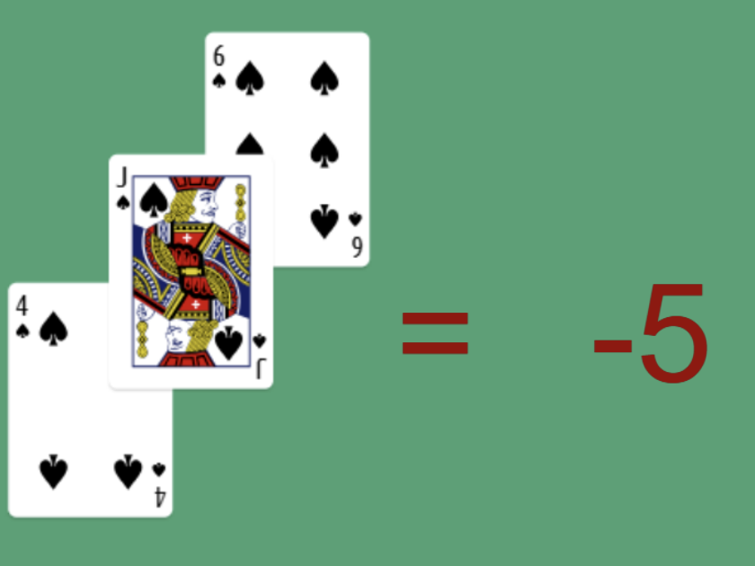

# 🚀 Comprehensive Test Document 测试文档

This document tests **all formatting elements** with *complex combinations* and ***bold italic*** text.

## 📋 Lists with Complex Formatting

### Unordered Lists
- **Bold item** with [link to Google](https://google.com)
- *Italic item* with `inline code` and 🎉 emoji
- ***Bold italic*** with  
- Regular text with 
- 东亚文字测试 with **粗体** and *斜体*
- Code reference: `numpy.array()` in Python

### Ordered Lists
1. **First step**: Install dependencies with `pip install package`
2. ***Second step***: Run the application 🚀
3. *Third step*：测试东亚字符支持 with **formatting**
4. Final step with multiple elements: **bold**, *italic*, `code`, and [link](https://example.com)

## 💻 Complex Code Block

Here's a comprehensive Python example with multiple indentation levels:

```python
# Complex class with nested methods and decorators
class DataProcessor:
    """
    A comprehensive data processing class
    支持中文注释和 🐍
    """
    
    def __init__(self, config_path: str):
        self.config = self._load_config(config_path)
        self.cache = {}
        
    @property
    def is_ready(self) -> bool:
        """Check if processor is ready"""
        return bool(self.config and self.cache)
    
    @staticmethod
    def validate_data(data: dict) -> bool:
        """Validate input data structure"""
        required_keys = ['id', 'timestamp', 'values']
        return all(key in data for key in required_keys)
    
    def process_batch(self, items: list) -> dict:
        results = {'processed': 0, 'errors': []}
        
        for i, item in enumerate(items):
            try:
                if self.validate_data(item):
                    processed = self._transform_item(item)
                    self.cache[processed['id']] = processed
                    results['processed'] += 1
                else:
                    results['errors'].append(f"Invalid item at index {i}")
            except Exception as e:
                results['errors'].append(f"Error processing item {i}: {str(e)}")
                
        return results
```

## 🌐 Links and Images Testing

### Various Link Types
- Simple link: [Google](https://google.com)
- **Bold link**: [**GitHub**](https://github.com)
- *Italic link*: [*Documentation*](https://docs.python.org)
- Link with emoji: [🚀 Rocket Launch](https://nasa.gov)
- 中文链接: [百度搜索](https://baidu.com)

### Image Testing
- URL image: 
- Local image: 
- Image with emoji alt: 
- 中文图片: 

## 📚 Heading Hierarchy Test

# H1: Main Title 主标题 🎯
## H2: Section Header 章节标题 📖
### H3: Subsection 子章节 📝
#### H4: Detail Level 详细级别 🔍
##### H5: Fine Details 精细详情 ⚡
###### H6: Micro Level 微观级别 🔬

## 🎨 Complex Formatting Combinations

This paragraph contains **bold text with *nested italic*** and ***bold italic with `inline code`***. 

Here's a sentence with multiple elements: **Bold 粗体**, *italic 斜体*, `code 代码`, [link 链接](https://example.com), and emoji 🌟.

### Mixed Content Line
**Bold start** then normal text, then *italic middle* with `code snippet`, followed by [a link](https://test.com), and ending with emoji 🎉 and 东亚文字.

## 🧪 Special Characters and Unicode

- Mathematical symbols: α β γ δ ∑ ∫ ∞ ≈ ≠ ≤ ≥
- Currency: $ € ¥ £ ₹ ₿
- Arrows: → ← ↑ ↓ ↔ ⇒ ⇐ ⇑ ⇓
- Symbols: ★ ☆ ♠ ♥ ♦ ♣ ☀ ☁ ☂ ❄
- Emojis: 🚀 🎉 🔥 💡 🌟 ⭐ 🎯 📚 💻 🌈
- East Asian: 日本語 한국어 中文 繁體中文 ไทย العربية

### Code with Unicode
```javascript
// Unicode support test 测试
const messages = {
    greeting: "Hello 你好 こんにちは 안녕하세요",
    emoji: "🚀🎉🔥💡",
    symbols: "→←↑↓★☆♠♥"
};

function processMessage(type) {
    // Process different message types
    switch(type) {
        case 'greeting':
            return `${messages.greeting} 🌟`;
        case 'celebration':
            return `Success! ${messages.emoji}`;
        default:
            return `Unknown type ${messages.symbols}`;
    }
}
```

## 📊 Final Complex Example

This final section combines everything: **Bold text with [link](https://example.com)**, *italic with `code`*, ***bold italic with emoji 🎉***, and complex formatting with 东亚文字支持.

### Summary List
1. **Headings**: H1 through H6 ✅
2. **Text formatting**: Bold, italic, bold-italic ✅  
3. **Code**: Inline `code` and blocks ✅
4. **Links**: Various types and combinations ✅
5. **Images**: URL and local references ✅
6. **Lists**: Ordered and unordered with formatting ✅
7. **Unicode**: East Asian characters and emojis ✅
8. **Complex combinations**: Mixed formatting ✅

---

*End of comprehensive test document* 🏁
